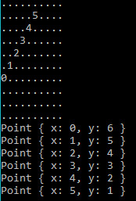
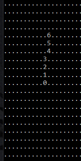

## Bracket-Geometry Examples

### bresenham_circle

[Source Code](https://github.com/amethyst/bracket-lib/tree/master/bracket-geometry/examples)

This demonstrates the use of `BresenhamCircle` to plot gridded circles, quickly and with compensation for grid locations.


### bresenham_line

[Source Code](https://github.com/amethyst/bracket-lib/blob/master/bracket-geometry/examples/bresenham_line.rs)

This example draws a line and plots it on the console, using Bresenham's Line algorithm.



### bresenham_sweep

[Source Code](https://github.com/amethyst/bracket-lib/blob/master/bracket-geometry/examples/bresenham_sweep.rs)

This example sweeps from 0 to 360 degrees, using `bracket-geometry` angle functions. It then projects a point along that angle, and draws a Bresenham Line to the new point.



### distance

[Source Code](https://github.com/amethyst/bracket-lib/blob/master/bracket-geometry/examples/distance.rs)

This example calculates the distance between two points using Pythagoras, Pythagoras Squared, Manhattan and Chebyshev distance algorithms.

```
Given the two points:
Point {
    x: 0,
    y: 0,
}
Point {
    x: 10,
    y: 20,
}

Pythagoras Distance: 22.36068
Pythagoras Squared Distance: 500
Manhattan Distance: 30
Chebyshev Distance: 20
```

### vector_line

[Source Code](https://github.com/amethyst/bracket-lib/blob/master/bracket-geometry/examples/vector_line.rs)

This example uses vector math to plot a line, rather than Bresenham. It can be slightly faster on some CPUs, if you are plotting enough lines (or long enough lines) for the floating-point math to make a difference. Lines aren't quite as nice as their Bresenham brethren.

```
..........
.*........
..*.......
..**......
...*......
....*.....
.....*....
.....**...
......*...
.......*..
```